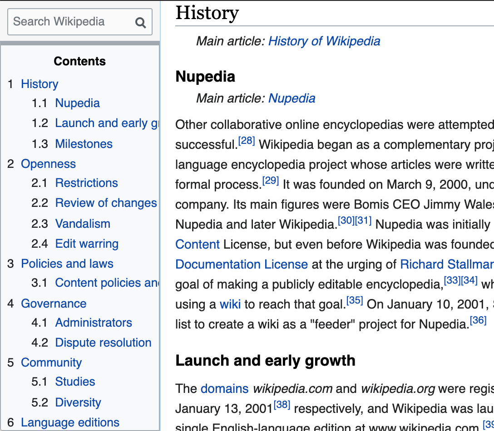
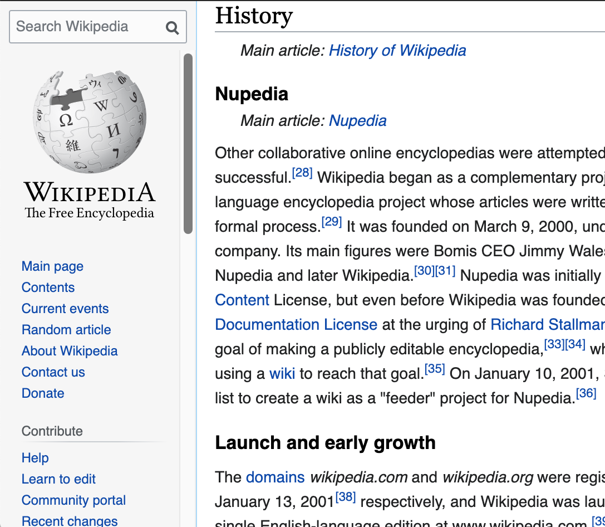
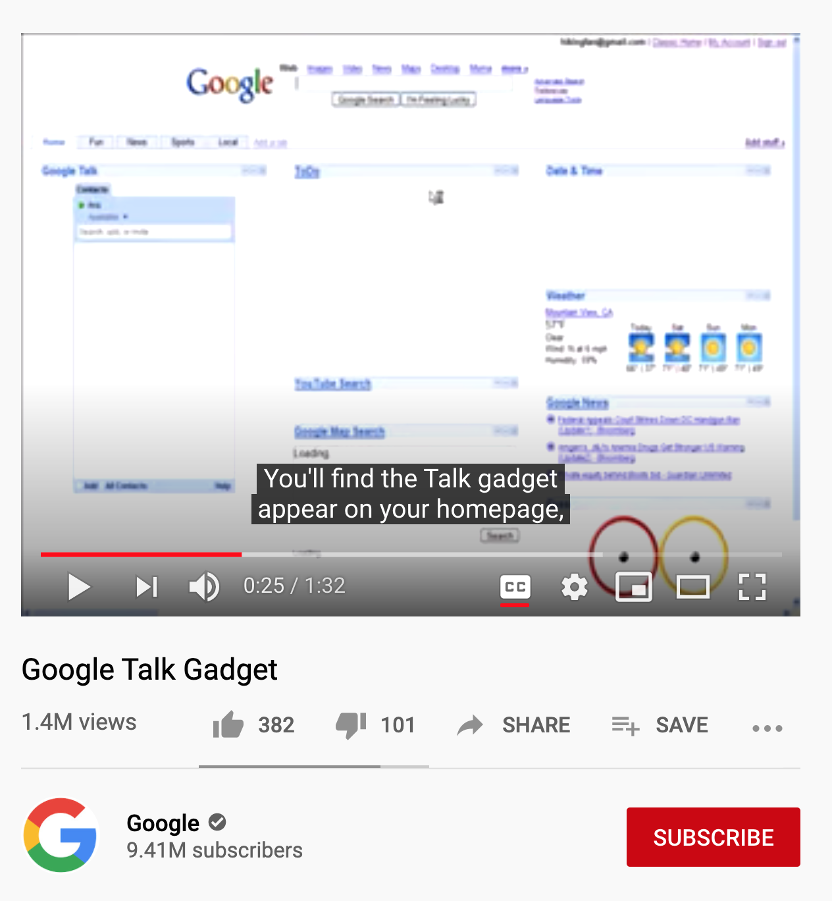
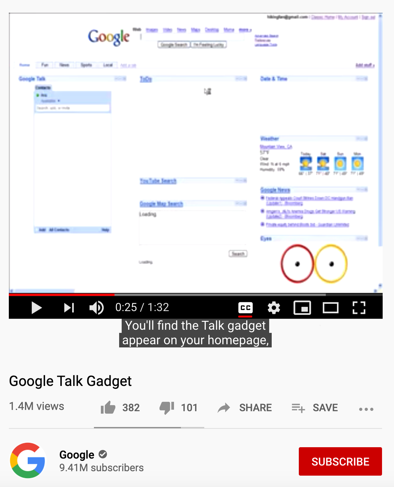

# Stylesheets
This repo contains some CSS for use with a web extension like Stylus, which allows you to customize the appearance of websites.

## Requirements
1. Install Stylus: [Firefox](https://addons.mozilla.org/en-US/firefox/addon/styl-us/) / [Chrome](https://chrome.google.com/webstore/detail/stylus/clngdbkpkpeebahjckkjfobafhncgmne).  
1. Then open one of these:
    * [wikipedia.css](https://raw.githubusercontent.com/sw-uci/stylesheets/master/wikipedia.user.css)
    * ~~youtube-outside-controller.css~~

## Description/Screenshots
### wikipedia.css
Moves the searchbar to the top left, and persists there even when the page is scrolled.

Also moves the Table of Contents (TOC) into the sidebar, allowing you to read the page and easily reference the TOC at the same time without having to scroll all the way up. 

The original sidebar is still accessible by hovering the area underneath the search bar, so you can still access page tools and other language options.

    
Click here to see screenshots.

    

        
         
         
        
    

### youtube-outside-controller.css 
This puts the video controller outside of the video. It allows you to see the entire video area without being obscured by the darkened gradient or the video controller at the bottom of the video. This is especially useful when the video uploader puts text (e.g. subtitles/closed captions) in this region.

Not maintained. Workaround: use the Picture-in-Picture (PIP) feature. Right click the video to show YouTube's menu, then right click again to access the real contextual menu. Choose PIP from here. The controls and captions will still be available on the page while the video plays in the popup.

    
Click here to see screenshots.

    <table>
        <tr>
            <td>Before</td>
            <td>After</td>
        </tr>
        <tr>
            <td></td>
            <td></td>
        </tr>
        <tr>
            <td>Video controller and captions obscure the video.</td>
            <td>Video controller and captions <i>no longer</i> obscure the video.</td>
        </tr>
    </table>

